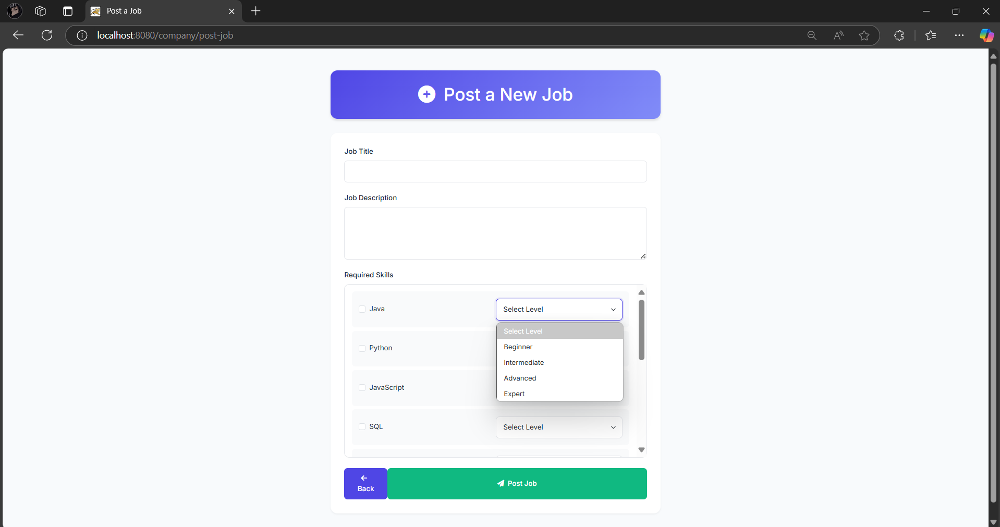
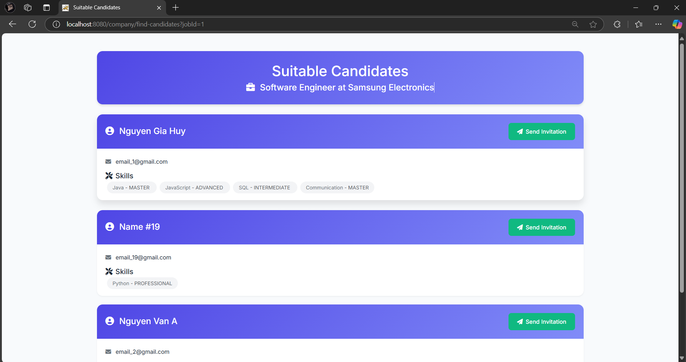
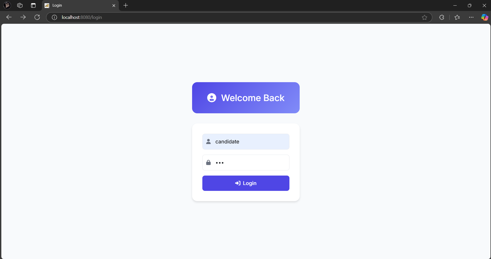

# Lab05_WWW_Java
# Ứng dụng Cổng Việc Làm

## Mô tả
Dự án này là một ứng dụng cổng việc làm được thiết kế để kết nối người tìm việc với các nhà tuyển dụng tiềm năng. Nó bao gồm các tính năng cho phép ứng viên tìm kiếm và ứng tuyển công việc, và cho phép công ty đăng tin tuyển dụng và tìm kiếm ứng viên phù hợp.

## Công nghệ sử dụng
- **Java**: Logic backend
- **Spring Boot**: Framework để xây dựng ứng dụng
- **Thymeleaf**: Template engine để render HTML
- **Bootstrap**: Framework CSS cho thiết kế responsive
- **Font Awesome**: Biểu tượng
- **Google Fonts**: Typography

## Tính năng chính
- **Bảng điều khiển ứng viên**: Xem và tìm kiếm danh sách công việc, quản lý kỹ năng và ứng tuyển công việc.
- **Bảng điều khiển công ty**: Đăng tin tuyển dụng mới, xem và quản lý danh sách công việc, và tìm kiếm ứng viên phù hợp.
- **Hệ thống đăng nhập**: Đăng nhập an toàn cho cả ứng viên và công ty.

## Hình ảnh minh họa
### Bảng điều khiển ứng viên


### Bảng điều khiển công ty


### Đăng tin tuyển dụng


### Ứng viên phù hợp


### Trang đăng nhập


## Hướng dẫn cài đặt
1. **Clone repository**
   ```bash
