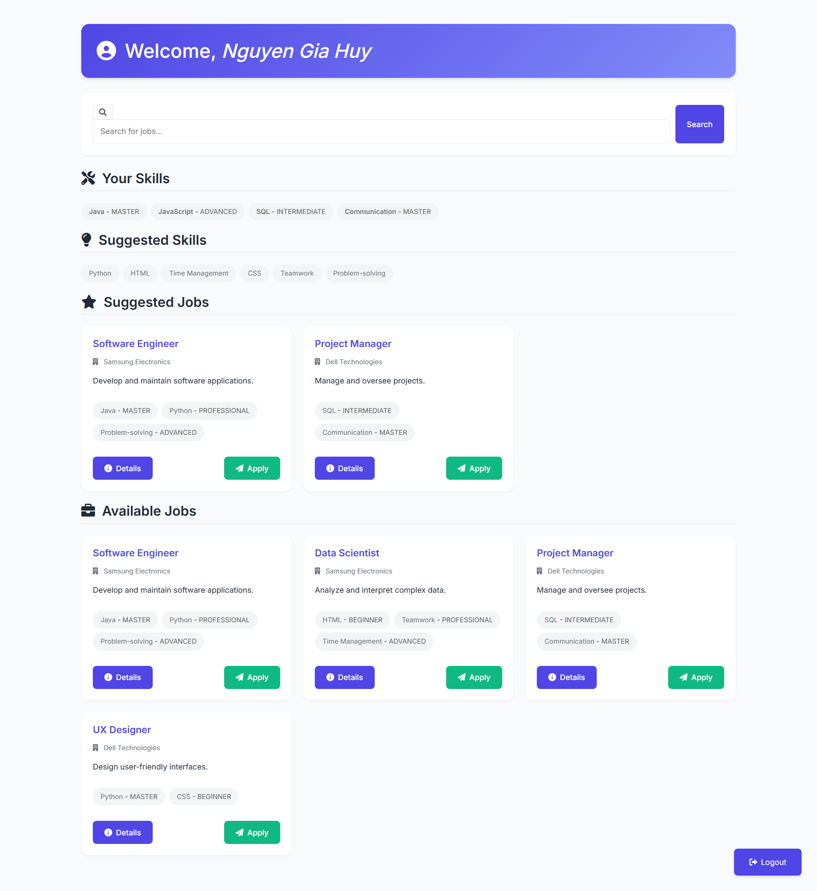
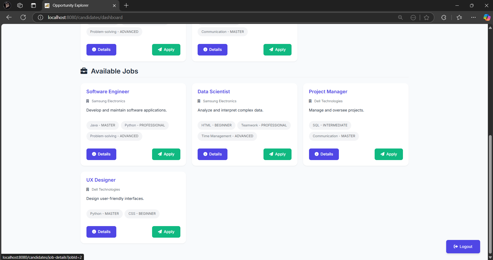
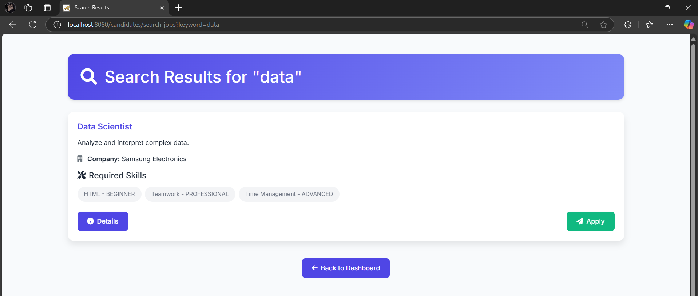
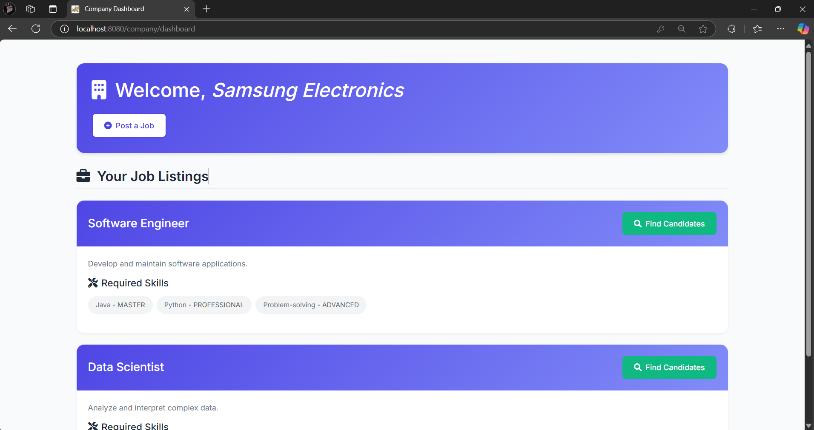
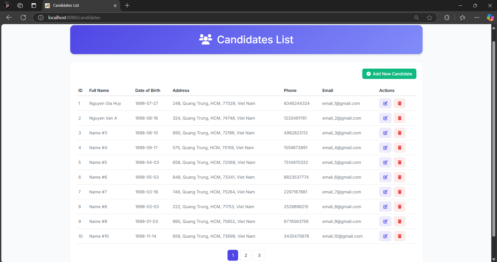
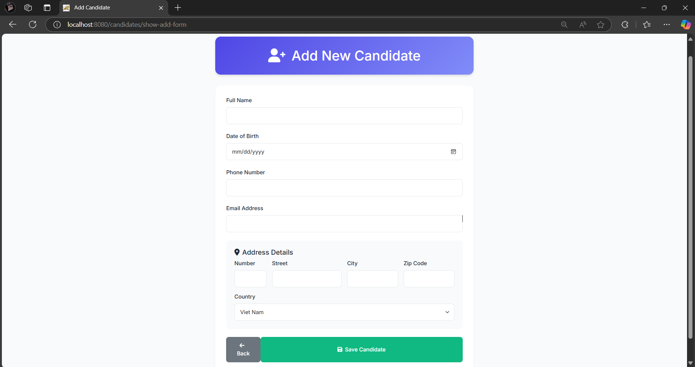

# LẬP TRÌNH WWW JAVA - LAB 05

## Sinh viên thực hiện
- **Họ tên**: Nguyễn Gia Huy
- **Mã số sinh viên**: 21045081
  
## Mô tả
Dự án này là một ứng dụng cổng việc làm được thiết kế để kết nối người tìm việc với các nhà tuyển dụng tiềm năng. Nó bao gồm các tính năng cho phép ứng viên tìm kiếm và ứng tuyển công việc, và cho phép công ty đăng tin tuyển dụng và tìm kiếm ứng viên phù hợp.

## Công nghệ sử dụng
- **Backend**: Spring Boot, Spring Security, Spring Data JPA
- **Frontend**: Thymeleaf, Bootstrap
- **Database**: MySQL
- **Build tool**: Gradle
- **IDE**: IntelliJ IDEA
- **Version control**: Git, GitHub

## Tính năng chính
- **Ứng viên**
  - Xem gợi ý công việc dựa trên kỹ năng
  - Xem tất cả công việc
  - Tìm kiếm công việc
- **Công ty**
  - Đăng bài tuyển dụng
  - Tìm kiếm ứng viên phù hợp
  - Xem danh sách ứng viên
  - Gửi mail cho ứng viên

## Hình ảnh 

### Trang đăng nhập

### Trang chủ ứng viên

#### Gợi ý công việc - Gợi ý skill

#### Tất cả công việc

### Tìm kiếm công việc (tương đối với tên và mô tả)

### Trang chủ công ty

### Đăng tin tuyển dụng

### Tìm kim ứng viên tiềm năng

### Danh sách ứng viên

### Thêm ứng viên

## Hướng dẫn cài đặt
1. **Clone repository**
   https://github.com/dawydev/Lab05_WWW_Java.git
2. **Mở project bằng IDE**
   - IntelliJ IDEA
   - Eclipse
3. **Cài đặt MySQL**
    - Tạo database mới với tên `works` và mở file `data-lab-05.sql` và chạy các câu lệnh trong đó để tạo bảng và dữ liệu mẫu
    - Mở file `application.properties` trong `src/main/resources` và cấu hình lại thông tin kết nối database
4. **Chạy ứng dụng**
